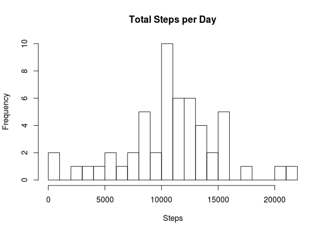
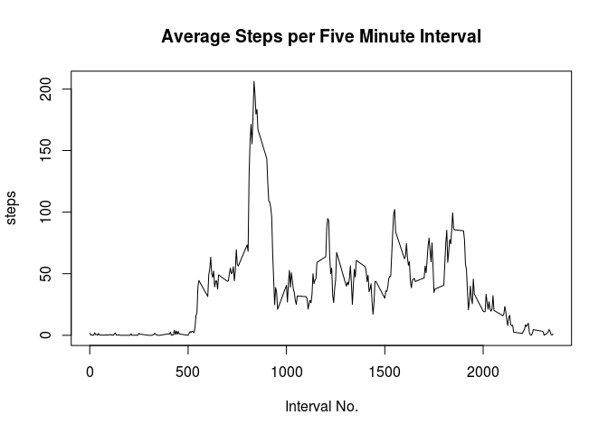
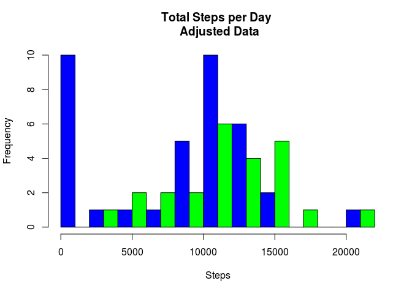
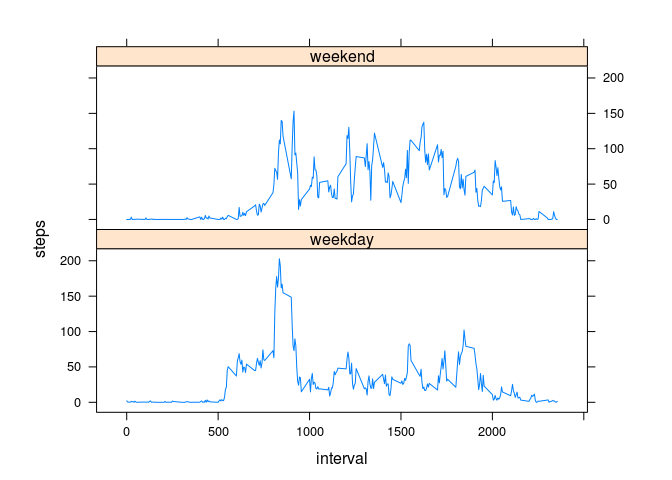

# Reproducible Research: Peer Assessment 1
# Reproducible Research - Course Project 1
This project satifies the requirements set forth in the John Hopkins University's Reproducilbe Research Course Project 1. The data for this assigment was retrieved from the course web site:

    Dataset: [Activity monitoring data](https://d396qusza40orc.cloudfront.net/repdata%2Fdata%2Factivity.zip)
    
The data set above was downloaded and extracted with the following code:

First the global environment is cleared. The working directory need to be created prior to running the code. The code first checks to see if the zip archive has been downloaded, if not, it downloads the file. It next checks to see if activity.zip exists, if not, it extracts is to the ./Data director. The csv file is loaded into the activity object and the date column is formatted as a date type.


```r
# clean the global environment
rm(list = ls())
# set the working directory to the Course-Project-1 director
setwd("~/Documents/Coursera/Reproducable-Research/Course-Project-1")

# check to see if the file has been downloaded, if not, download the file
if (!file.exists("./Data/repdata%2Fdata%2Factivity.zip")) {
  download.file("https://d396qusza40orc.cloudfront.net/repdata%2Fdata%2Factivity.zip", "./Data/repdata%2Fdata%2Factivity.zip", method = "curl")
  
}

# check to see if the archives.csv exists, if not, extract it
if (!file.exists("./Data/archives.csv")) {
  unzip("./Data/repdata%2Fdata%2Factivity.zip", exdir = "./Data/")
  
}

# read the csv and load the activity object
# format the date column as a date value
activity <- read.csv("./Data/activity.csv", stringsAsFactors = FALSE)
activity$date <- as.Date(activity$date)
```

The activity variables included loaded from the ataset are:

* steps: Number of steps taking in a 5-minute interval (missing values are coded as NA)
* date: The date on which the measurement was taken in YYYY-MM-DD format
* interval: Identifier for the 5-minute interval in which measurement was taken

17,568 observations were loaded from the dataset into the activity object.

## What is mean total number of steps taken per day?
Using the activity object with the aggregate function, the comparision of steps to date was made using a histogram. The instructional assignment asks for the difference between a barplot and a histogram. *italic*Forbes*italic* has an article that provdes a good reminder that historgrams visualize distribution while the box charts compares 2 variables. [Forbes](http://www.forbes.com/sites/naomirobbins/2012/01/04/a-histogram-is-not-a-bar-chart/#1da0e8ab28af)


```r
echo = TRUE
# Question 1: What is mean total number of steps taken per day?
q1 <- aggregate(steps ~ date, data=activity, sum, na.rm = TRUE)
hist(q1$steps, breaks=20, main="Total Steps per Day", xlab="Steps")
```



```r
# Calculate the mead and median
s <- summary(q1$steps)
Mean_number_of_steps <- paste("The mean number of steps is: ", s["Mean"])
print(Mean_number_of_steps)
```

```
## [1] "The mean number of steps is:  10770"
```

```r
Median_number_of_steps <- paste("The median number of steps is: ", s["Median"])
print(Median_number_of_steps)
```

```
## [1] "The median number of steps is:  10760"
```

## What is the average daily activity pattern?
A time series plot was made using type = "l" by plotting the 5-minute interval and the average number of steps across all days. 


```r
echo=TRUE
# Question 2: What is the average daily activity pattern?
stepsdata <- aggregate(steps ~ interval, data=activity, mean, na.rm=TRUE)
plot(stepsdata$interval, stepsdata$steps, type="l", main="Average Steps per Five Minute Interval",
     xlab="Interval No.", ylab="steps")
```



```r
maxsteps <- max(stepsdata$steps)
print(paste("The maximum number of steps in a five minute interval was: ", maxsteps))
```

```
## [1] "The maximum number of steps in a five minute interval was:  206.169811320755"
```

```r
# Missing values in steps
# Approach is to fill NAs with the median value

# Report the number of missing values
missingdata <- sum(is.na(activity$steps))
print(paste("There are", missingdata, "missing data points."))
```

```
## [1] "There are 2304 missing data points."
```

```r
# Adjusted NA values
Adjdata <- activity
Adjdata$steps[is.na(Adjdata$steps)] <- median(activity$steps, na.rm=TRUE)
Adjdataday <- aggregate(steps ~ date, data=Adjdata, sum, na.rm=TRUE)
hist(Adjdataday$steps, breaks=20, main="Total Steps per Day \n Adjusted Data",
     xlab="Steps", ylab="Frequency", col = c("blue", "green"))
```



```r
bsteps_mean <- mean(Adjdata$steps)
bsteps_median <- median(Adjdata$steps)
print(paste("The mean is: ", bsteps_mean))
```

```
## [1] "The mean is:  32.4799635701275"
```

```r
print(paste("The median is: ", bsteps_median))
```

```
## [1] "The median is:  0"
```
The replacement of NAs with the median had no impact on the median but did reduce the mean.

## Are there differences in activity patterns between weekdays and weekends?
Two 2 plots were created to answer this question. The use of the R weekdays function added the day of the week based on the date.  An additional column was added that categorized the date as either weekday or weekend. A plot for the weekend and weekday(s) was created. By visually comparing the 2 plots, sustained weekend activity was stronger.


```r
# Weekend vs Weekday activity
# already performed betterdata$date <- as.Date(betterdata$date)
Adjdata$dayname <- weekdays(Adjdata$date)
Adjdata$weekend <- as.factor(ifelse(Adjdata$dayname == "Saturday" |
                                         Adjdata$dayname == "Sunday", "weekend", "weekday"))
library(lattice)
plotdata <- aggregate(steps ~ interval + weekend, Adjdata, mean)
xyplot(steps ~ interval | factor(weekend), data=plotdata, aspect=1/3, type="l")
```



Visual inspection of the 2 graphs indicates that the area under the curve of the weekend graph is higher.
